# CarND-Traffic-Sign-Classifier
Building a neural network to classify 43 different types of road sign in Pytorch.

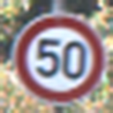   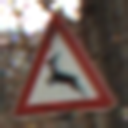 

## Description

The objective of the project is to classify road signs. The project came from Udacity and was initially done in tensorflow. I have used Pytorch in this revisited version. The project uses a dataset of 34,800 images covering 43 different types of road sign. The dataset can be downloaded [here](https://d17h27t6h515a5.cloudfront.net/topher/2017/February/5898cd6f_traffic-signs-data/traffic-signs-data.zip). More details about the dataset can be found [here](http://benchmark.ini.rub.de/?section=gtsrb&subsection=dataset).

Key steps:
- Load and Explore, summarize and visualize the data set
- Perform pre-processing of the data
- Design, train and test a model architecture
- Use the model to make predictions on test images

## Loading the dataset

The zip archive contains 3 pickle files with training, validation and test RGB images, all 32x32 pixels. The zip file also contains a CSV file (signnames.csv) with the first column containing the class ID (an integer spanning 0-42), and the second column containing a descriptive name of the sign. Here are the first 5 rows:

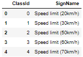

## Data augmentation

The provided train dataset is highly unbalanced between classes. A few classes have large number of samples when many others have a limited amount only. This is a problem for the training phase and data augmentation is necessary to rebalance class distribution.

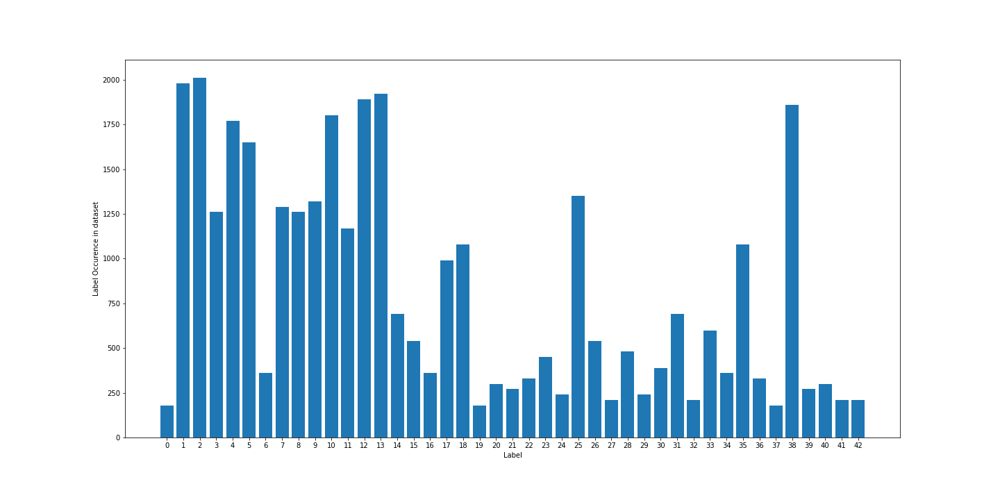

Data augmentation is performed in several steps towards achieving a minimum number of samples in under-represented classes. This threshold is set at 1000 images or 1500 images.
A threshold of 1000 images minimum per class results into 16,891 new images from the data augmentation steps bringing the dataset from 34,800 up to 51,700 images (+50%). I achived the highest results with the dataset build upon the 1500 threshold. With this threshold, 32,580 additonal images were generated, bringing the augmented training dataset to a total of 67,380 images, twice as much as the initial size.

Data augmentation is performed using : 
- symetry invariance : several road sign types are invariant to horizontal flip ('No entry'), or vertical flip ('No vehicules', 'No entry') or rotation ('roundabout mandatory').
- symetry transpose : a few signs transpose to another using horizontal symetry ('Dangerous curve to the left' --> 'Dangerous curve to the right')
- combination of small rotation (max 15°), horizont/vertical shift (max 3 pixels) and image crop (max 2 pixels on each sides).

The resulting dataset is much more balanced which will faciliate the training process.

Training dataset post data augmentation:
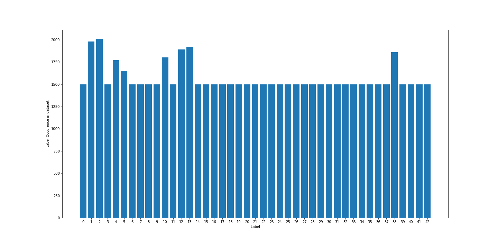

## Data preprocessing

The provided dataset is composed of RGB frames from short videos of road signs.

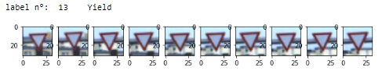  

Shooting conditions are inconsistent resulting into a bunch of poor quality images: over-exposed, extremely dark (night pictures), very shaky. Some images are even difficult to determine just looking at them. This might affect the training process and overall performance of the model. To compensate, several pre-processing approaches were used.

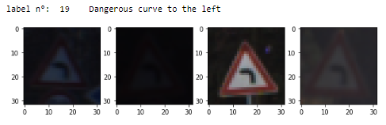                              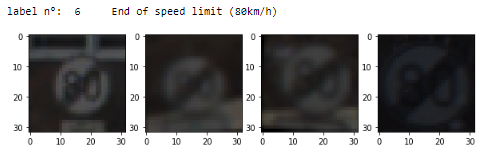

- Testing different color-spaces. While HLS and HSV do not really help on problematic images (most channels are terribly damaged by the poor shooting conditions), the LAB space offers its L-channel where underexposed/dark images can be nicely recovered. The L-channel is known to be robust to change of light intensity. I have therefore trained a model using the L-channel of the images. This approach however requires to pre-process images submitted to the model.

Gain from using LAB color space (original image, LAB image followed by each channel L, A and B). Channel L offers good performance with poor exposures.

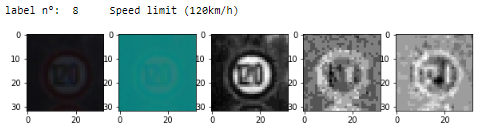                                      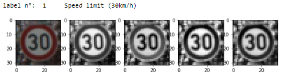

- Normalizing the exposure using CLAHE Histogram normalization. I combined this approach when using the L-channel as it brought a small contrast improvement. Histogram normalization was performed on grayscale images and RGB images. It is even possible to merge both gray-CLAhe and RGB-clahe images into 4-channel images providing combined information to the model. This requires however heavy preprocessing and we can also let the model learn these normalization on its own.

Panel of pre-processing explored with original image, grayscale, grascale post CLAHE, RGB post CLAHE normalization and combined 4-channel image.

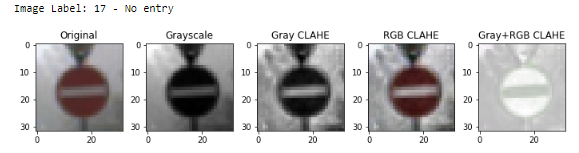

In the end, following various trials, I trained different models using two approachs:
- no preprocessing using only the augmented dataset
- preprocessing using L-channel and histogram normalization (clahe image processing)

Original image followed by LAB channel L, LAB channel L with CLAHE histogram normalization, A and B channels. Small contrast improvement.

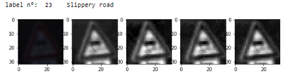

## Model architecture

The architecture is inspired from previous research. In the following descriptive [paper](http://yann.lecun.com/exdb/publis/pdf/sermanet-ijcnn-11.pdf), Yann LeCun summarizes the philosophy of the approach: "The approach is based on Convolutional Networks (ConvNets), a biologically-inspired, multilayer feed-forward architecture that can learn multiple stages of invariant features using a combination of supervised and unsupervised learning. Each stage is composed of a (convolutional) filter bank layer, a non-linear transform layer, and a spatial feature pooling layer. The spatial pooling layers lower the spatial resolution of the representation, thereby making the representation robust to small shifts and geometric distortions, similarly to “complex cells” in standard models of the visual cortex. ConvNets are generally composed of one to three stages, capped by a classifier composed of one or two additional layers. A gradient-based supervised training procedure updates every single filter in every filter bank in every layer so as to minimizes a loss function".

In summary, for the augmented RGB dataset, I used three convolutional blocks (Conv2D>Relu activation>MaxPool2D) followed by a dense network of three fully-connected blocks (LinearLayer>Relu>DropOut) delivering the classification output. The Conv2D layers are used to extract the approapriate features from the image (from 3 to 8, 16, 32 feature channels) while the maxpooling layers down-sample the x-y dimensions by a factor 2 at each block (total down-sampling of 2^3=8 from 32x32 to 4x4). A feature vector, summarizing the key information is fed to the Dense network generating a probabilistic distribution over the 43 class options. During training, the model learns what to extract to maximize its prediction accuracy. L-channel images required adaptation of the input size to 1-channel. 

I used :
- torch CrossEntropyLoss which combines a `LogSotfmax()` activation and `NLLLoss()` fonction
- Adam optimizer (lr of 0.001 reduced to 0.0005 during fine-tuning)
- batch size of 256
- dropout keep rate of 0.5

BatchNormalization of the Conv blocks deteriorates the learning process and was discarded. The summary of the model architecture is shown below.

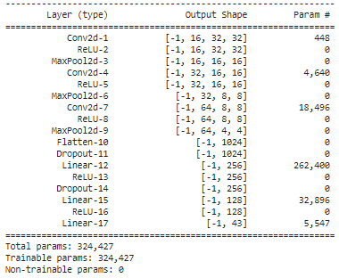

## Results

The performance using either grayscale or L-channel images ended below the RGB augmented dataset. The following results were achieved after 20 epochs. The model is able to predict road signs correctly even with poor shoots. The saved model weigthts can be found in the folder `models` of this repository.

Model with no pre-processing:

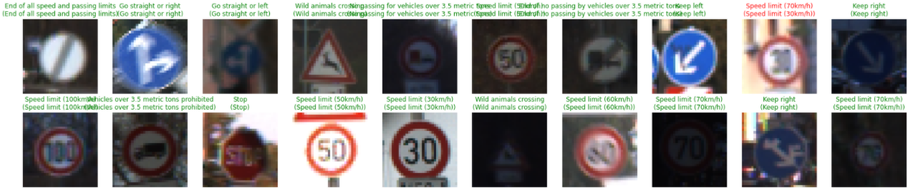

Model with Channel L preprocessing:

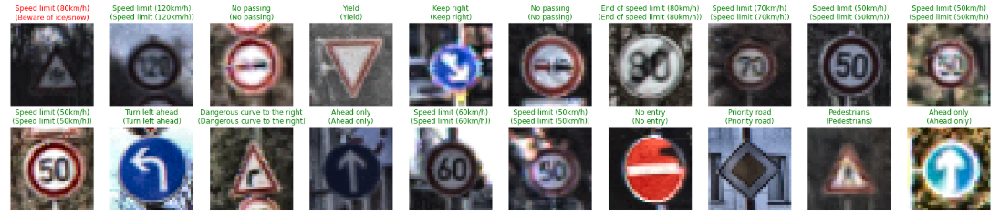

Overall performance:

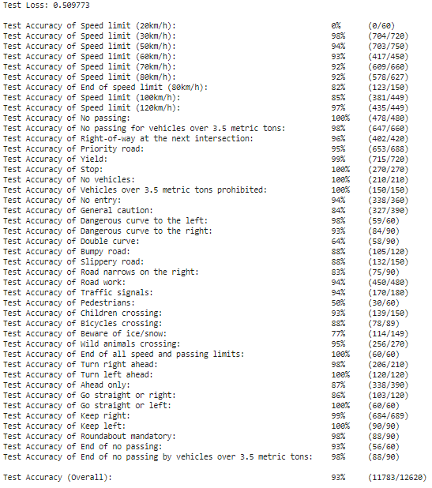

Performance using sample internet pictures:

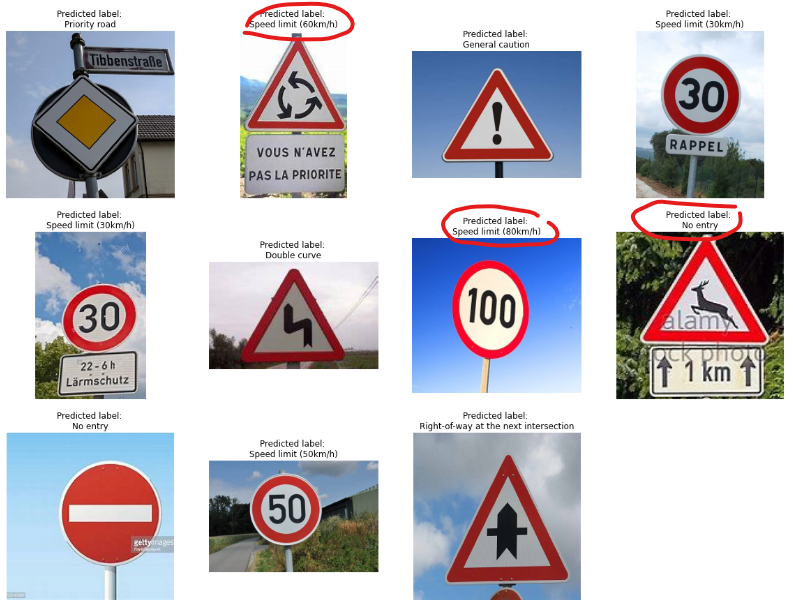

Feature maps corresponding to the 16 extraction layers generated by the first Conv Layer. With the first three features, we can assume the model aims to extract elements capable to characterize and differentiate road signs in very dark settings. The activation comes also from edge detection and transverse change of light ( diagonal gradients).

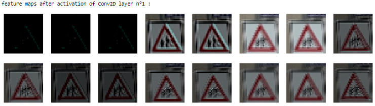
