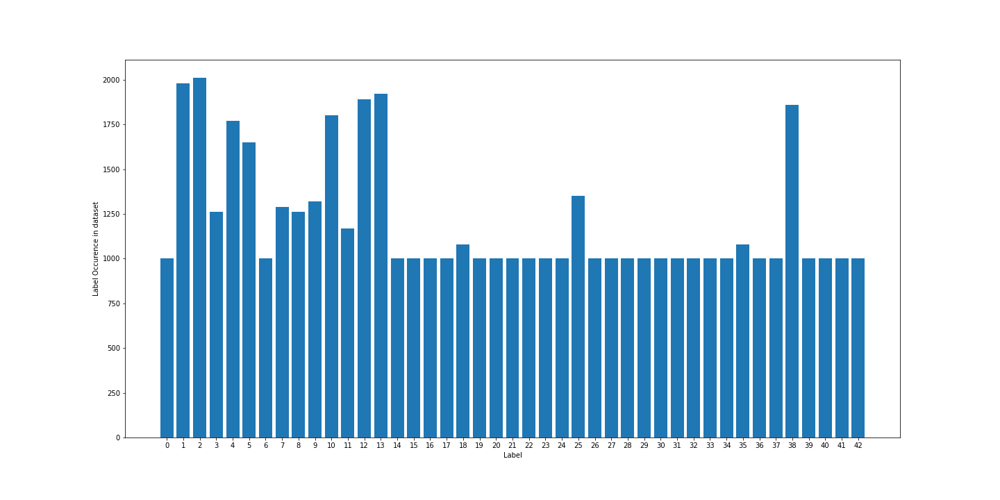

# CarND-Traffic-Sign-Classifier
Building a neural network to classify 43 different types of road sign in Pytorch.

## Description

The objective of the project is to classify road signs. The project came from Udacity and was initially done in tensorflow. I have used Pytorch in this revisited version. The project uses a dataset of 34,800 images covering 43 different types of road sign. The dataset can be downloaded [here](https://d17h27t6h515a5.cloudfront.net/topher/2017/February/5898cd6f_traffic-signs-data/traffic-signs-data.zip).

## Loading the dataset

The zip archive contains 3 pickle files with training, validation and test RGB images, all 32x32 pixels. The zip file also contains a CSV file (signnames.csv) with the first column containing the class ID (an integer spanning 0-42), and the second column containing a descriptive name of the sign. Here are the first 5 rows:

## Data augmentation

The provided train dataset is highly unbalanced between classes. A few classes have large number of samples when many others have a limited amount only. This is a problem for the training phase and data augmentation is necessary to rebalance class distribution.

Data augmentation is performed in several steps towards achieving a minimum number of samples in under-represented classes. This threshold is set at 1000 images or 1500 images.
A threshold of 1000 images minimum per class results into 16,891 new images from the data augmentation steps bringing the dataset from 34,800 up to 51,700 images (+50%).

Data augmentation is performed using : 
- symetry invariance : several road sign types are invariant to horizontal flip ('No entry'), or vertical flip ('No vehicules', 'No entry') or rotation ('roundabout mandatory').
- symetry transpose : a few signs transpose to another using horizontal symetry ('Dangerous curve to the left' --> 'Dangerous curve to the right')
- combination of small rotation (max 15°), horizont/vertical shift (max 3 pixels) and image crop (max 2 pixels on each sides).

The resulting dataset is much more balanced which will faciliate the training process.

Training dataset post data augmentation:

## Data preprocessing

The provided dataset is composed of RGB frames from short videos of road signs.

  

Shooting conditions are inconsistent resulting into a bunch of poor quality images: over-exposed, extremely dark (night pictures), very shaky. Some images are even difficult to determine just looking at them. This might affect the training process and overall performance of the model. To compensate, several pre-processing approaches were used.

                              

- Testing different color-spaces. While HLS and HSV do not really help on problematic images (most channels are terribly damaged by the poor shooting conditions), the LAB space offers its L-channel where underexposed/dark images can be nicely recovered. The L-channel is known to be robust to change of light intensity. I have therefore trained a model using the L-channel of the images. This approach however requires to pre-process images submitted to the model.

Gain from using LAB color space (original image, LAB image followed by each channel L, A and B). Channel L offers good performance with poor exposures.

                                      

- Normalizing the exposure using CLAHE Histogram normalization. I combined this approach when using the L-channel as it brought a small contrast improvement. Histogram normalization was performed on grayscale images and RGB images. It is even possible to merge both gray-CLAhe and RGB-clahe images into 4-channel images providing combined information to the model. This requires however heavy preprocessing and we can also let the model learn these normalization on its own.

Panel of pre-processing explored with original image, grayscale, grascale post CLAHE, RGB post CLAHE normalization and combined 4-channel image.

In the end I trained different models using two approachs:
- no preprocessing using only the augmented dataset
- preprocessing using L-channel and histogram normalization (clahe image processing)

Original image followed by LAB channel L, LAB channel L with CLAHE histogram normalization, A and B channels. Small contrast improvement.

## Results

The following results were achieved after 20 epochs. The model is able to predict road signs correctly even with poor shoots. We can assume the reults will be around 90 to 95% accuracy.

Model with no pre-processing:

Model with Channel L preprocessing:

